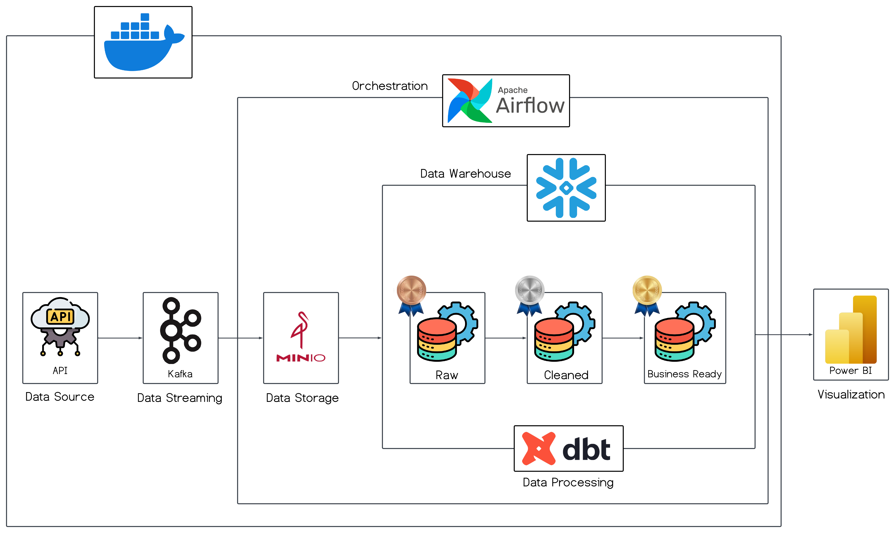
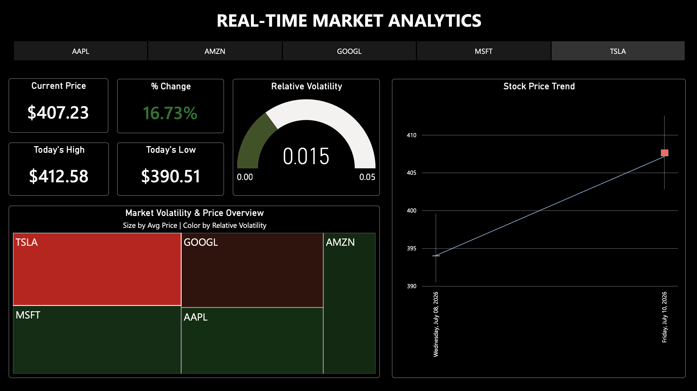

# Real-Time Stock Market Data Pipeline

## Project Overview
This project implements a comprehensive end-to-end data engineering pipeline designed to ingest, process, and visualize real-time stock market data. The system utilizes a hybrid architecture of streaming and batch processing to ensure high data integrity and low-latency insights. By leveraging a modern data stack, the pipeline transforms raw API responses from the Finnhub API into structured analytical models following the Medallion Architecture (Bronze, Silver, and Gold layers).

## System Architecture
The pipeline is designed for scalability and fault tolerance by decoupling storage from compute. Below is the visual representation of the system architecture:


1.  **Data Source**: Real-time equity data is fetched from the Finnhub Quote API.
2.  **Ingestion & Streaming**: A Python-based Producer publishes data to an Apache Kafka broker.
3.  **Intermediate Storage**: A Kafka Consumer ingests the stream and persists raw data as JSON objects into a MinIO (S3-compatible) storage environment.
4.  **Orchestration**: Apache Airflow schedules and manages the transfer of raw data from MinIO to Snowflake.
5.  **Data Warehousing**: Snowflake serves as the centralized Cloud Data Warehouse for all data layers.
6.  **Transformation**: dbt (data build tool) manages the transformation logic (ELT), organizing data into Bronze (Raw), Silver (Standardized), and Gold (Analytical) models.
7.  **Visualization**: Power BI connects to the Snowflake Gold layer via DirectQuery to provide real-time dashboarding.

## Technical Stack
*   **Containerization**: Docker, Docker Compose
*   **Messaging & Streaming**: Apache Kafka, Zookeeper, Kafdrop
*   **Object Storage**: MinIO (S3-Compatible)
*   **Orchestration**: Apache Airflow
*   **Data Warehouse**: Snowflake
*   **Data Transformation**: dbt (data build tool)
*   **Visualization**: Power BI
*   **Programming**: Python, SQL

## Data Pipeline Stages (Medallion Architecture)

### Bronze Layer (Raw Data)
*   **Source**: Raw JSON files retrieved from MinIO storage.
*   **Process**: Data is ingested into Snowflake using a VARIANT data type to preserve the original structure for auditability.

### Silver Layer (Cleaned Data)
*   **Process**: Schema enforcement, data type casting (converting Unix Epoch to Timestamp), deduplication using window functions, and handling of null values.
*   **Objective**: To provide a standardized and reliable dataset for analytical modeling.

### Gold Layer (Business Ready)
*   **Models**: 
    *   `gold_candlestick`: Aggregated metrics for Open-High-Low-Close (OHLC) analysis.
    *   `gold_kpi`: Current price snapshots and percentage changes per symbol.
    *   `gold_treechart`: Volatility and relative performance analysis for market mapping.
*   **Objective**: Optimized tables designed for low-latency reporting and executive dashboards.

## Visualization


The Power BI dashboard provides a real-time comprehensive view of the market using four key analytical components:

1. **Key Performance Indicators (KPIs)**: 
   - Displays the **Current Price** and **Percentage Change** using conditional formatting (Green for gains, Red for losses).
   - Provides **Today's High and Low** price points to give immediate context on the day's trading range.

2. **Stock Price Trend (OHLC Candlestick)**:
   - Visualizes the price movement over time using the Open-High-Low-Close format.
   - Includes a **Trend Line** (Moving Average) to help identify market direction and price momentum at a glance.

3. **Market Volatility & Price Overview (Treemap)**:
   - **Size Logic**: The size of each rectangle represents the **Average Price**, indicating the relative "market footprint" of each symbol.
   - **Color Logic**: The color gradient (Green to Red) represents **Relative Volatility**. This allows users to instantly identify which stocks are stable and which are experiencing high price fluctuations.

4. **Relative Volatility Gauge**:
   - Provides a focused quantitative risk assessment for the selected stock. 
   - It measures how much the price deviates from its mean, helping investors understand the current risk profile of their selection.

## Repository Structure
```text
STOCK-MARKET/
├── consumer/
│   └── consumer.py             # Script to ingest Kafka streams into MinIO
├── dags/
│   └── minio_to_snowflake.py   # Airflow DAG for Snowflake data ingestion
├── dbt_stocks/                 # dbt project directory
│   ├── models/
│   │   ├── bronze/             # Raw source definitions and staging models
│   │   ├── silver/             # Data cleaning and standardization models
│   │   └── gold/               # Business logic and analytical models
│   ├── dbt_project.yml         # dbt configuration file
├── producer/
│   └── producer.py             # Script to fetch API data and produce to Kafka
├── docs/
    ├── architecture_diagram.png 
│   ├── dashboard_preview.png   # Dashboard screenshot
│   └── stock_market_dashboard.pbix # Power BI project file
├── docker-compose.yml          # Infrastructure as Code for project services
├── requirements.txt            # Python package dependencies
└── README.md                   # Project documentation
```

## Project Setup
### Prerequisites
- Docker and Docker Compose installed.
- Python 3.9+ environment.
- Snowflake account with ACCOUNTADMIN privileges.
- Finnhub API Key.
### Execution Steps
1. **Infrastructure Initialization:**

    Launch the required services using Docker:
    ```bash 
    docker-compose up -d
    ```
2. **Environment Configuration:**

    Install Python dependencies in a virtual environment:
    ```bash
    pip install -r requirements.txt
    ```
3. **Data Streaming:**

    Execute the producer and consumer scripts in separate terminal sessions:
    ```bash
    python producer/producer.py
    python consumer/consumer.py
    ```
4. **Workflow Orchestration:**

    Access the Airflow UI at `localhost:8080`, configure the Snowflake connection, and trigger the `minio_to_snowflake` DAG.
5. **Data Transformation:**

    Navigate to the dbt directory and execute the transformation models:
    ```bash
    cd dbt_stocks
    dbt run
    ```
6. **Analytical Visualization:**

    Open the `.pbix` file in the `visualization` folder using Power BI Desktop and configure the Snowflake DSN to refresh the data.